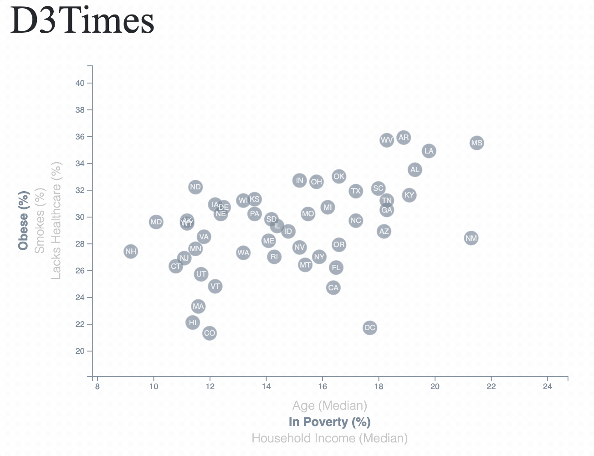

# D3-Data-Journalism

Penn Data Boot Camp Assignment 16 - An interactive application using D3.js to explore a US Census Bureau dataset by visualizing correlations between demographic characteristics and health risk factors in the United States.

## Objective
The focus of this exercise is using D3.js. The goal is to build an interactive scatter plot that is connected to a dataset and displays the correct information based on user inputs (aka. clicks for selecting variables of interests). X-Y coordinates of the circles, state abbreviations, and axes are scaled based on data input domains based on the selections.

Below is a highlight of the visualization interactivity. View the deployed Github Pages here: https://ztcnrh.github.io/D3-Data-Journalism/

 

